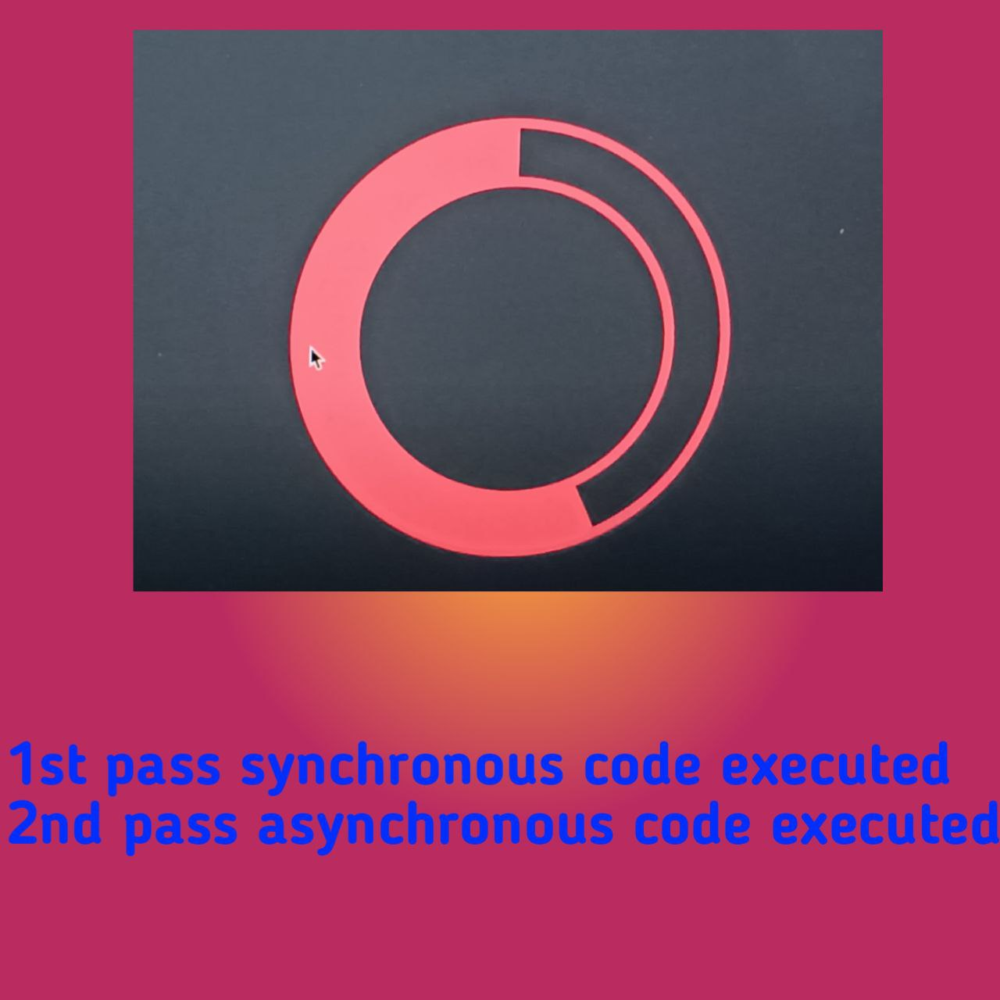
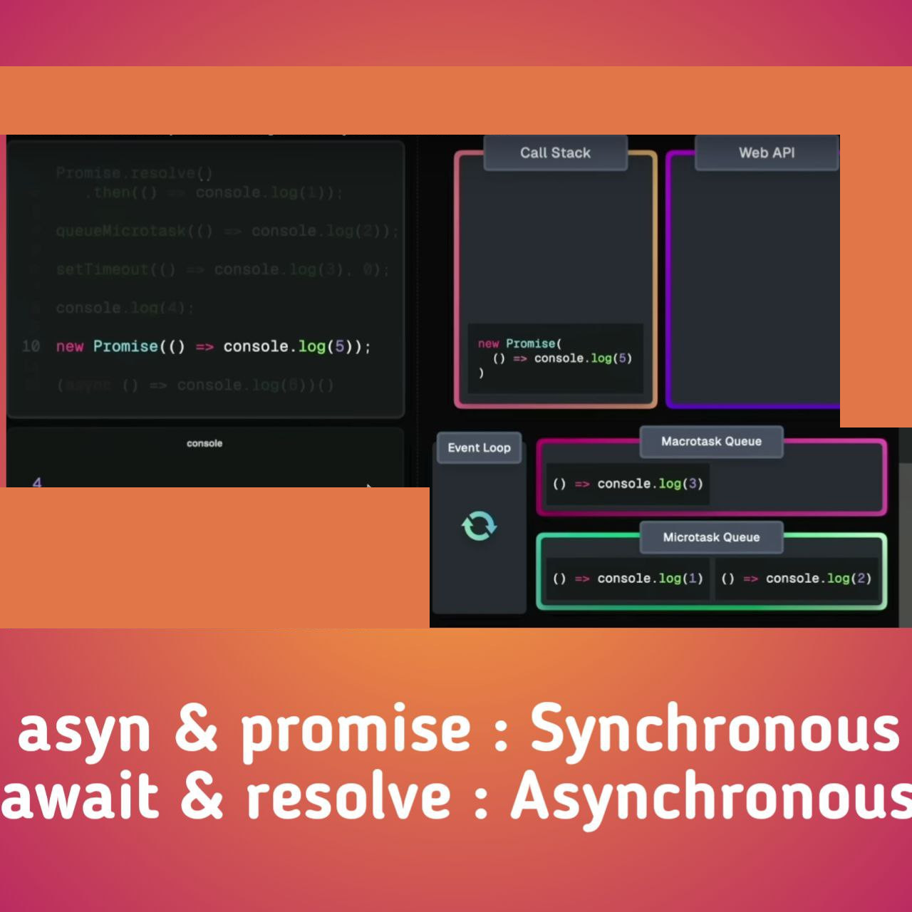
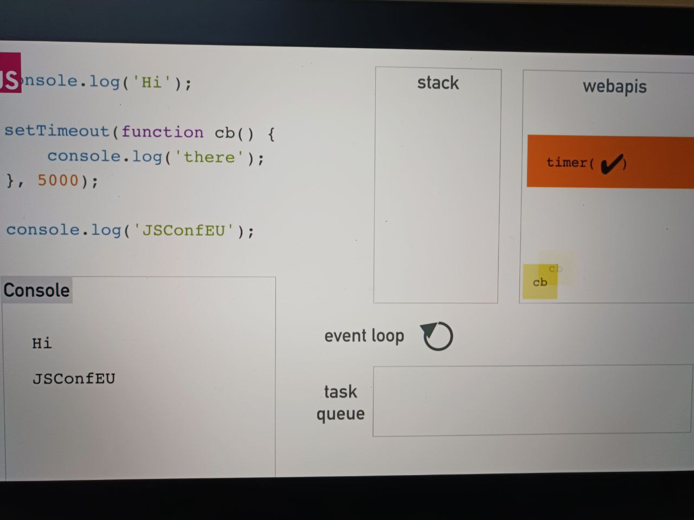
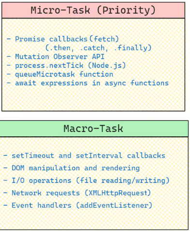

Topic 000: Event Loop, Microtasks and Macrotasks Queue

# Topic 000: Event Loop, Microtasks and Macrotasks Queue







---

- The event loop is a fundamental mechanism in JavaScript that manages the execution of asynchronous code. It ensures that non-blocking operations, like callbacks from events or promises, are executed efficiently without interrupting the main execution thread. Essentially, the event loop continuously checks the call stack and task queues (microtasks and macrotasks) and processes tasks in the appropriate order, enabling JavaScript to perform tasks asynchronously while maintaining a smooth, responsive user experience.

### Understanding Microtasks and Macrotasks in JavaScript

To understand how JavaScript executes asynchronous code, it’s essential to grasp the concepts of microtasks and macrotasks.

#### Microtasks

Microtasks are tasks that are executed immediately after the currently executing script and before any rendering or macrotasks. They have higher priority over macrotasks and are processed first in the event loop. Common sources of microtasks include:

1. **Promise Callbacks (`.then`, `.catch`, `.finally`)(fetch from Node.js)**
2. **Mutation Observer API**
3. **`process.nextTick` (Node.js)**
4. **`queueMicrotask` Function**
5. **`await` Expressions in Async Functions**

#### Macrotasks

Macrotasks are tasks that are executed after the current executing script and all microtasks have been processed. They include:

1. **`setTimeout` and `setInterval` Callbacks**
2. **DOM Manipulation and Rendering**
3. **I/O Operations (File Reading/Writing)**
4. **Network Requests (`XMLHttpRequest`)**
5. **Event Handlers (`addEventListener`)**

### Example Code and Execution Order

Let's look at an example JavaScript file that uses various microtasks and macrotasks to illustrate their execution order.

```javascript
console.log("Script start");

// Macro Task: setTimeout
setTimeout(() => {
  console.log("setTimeout");
}, 0);

// Micro Task: Promise
Promise.resolve()
  .then(() => {
    console.log("Promise 1");
  })
  .then(() => {
    console.log("Promise 2");
  });

// Macro Task: Fetch API
fetch("https://jsonplaceholder.typicode.com/posts/1")
  .then((response) => response.json())
  .then((data) => {
    console.log("Fetch API");
  });

// Macro Task: setImmediate (Node.js only)
if (typeof setImmediate !== "undefined") {
  setImmediate(() => {
    console.log("setImmediate");
  });
}

// Micro Task: process.nextTick (Node.js only)
if (typeof process !== "undefined" && process.nextTick) {
  process.nextTick(() => {
    console.log("process.nextTick");
  });
}

// Micro Task: queueMicrotask
queueMicrotask(() => {
  console.log("queueMicrotask");
});

// DOM Manipulation (Macro Task)
document.addEventListener("DOMContentLoaded", () => {
  console.log("DOM fully loaded and parsed");
});

console.log("Script end");
```

### Execution Order Explained

1. **Script start** and **Script end**: These synchronous log statements are executed first.
2. **Microtasks**:

   - `process.nextTick` (Node.js): Executed immediately after the current operation completes.
   - `queueMicrotask`: Executed after `process.nextTick`.
   - `Promise 1`: The first `.then` callback of the resolved promise.
   - `Promise 2`: The chained `.then` callback.
   - `fetch` response: `console.log("Fetch API");`

3. **Macrotasks**:
   - `setTimeout`: Executed after all microtasks are completed.
   - `setImmediate` (Node.js): Executed as a macrotask in Node.js.
   - `DOMContentLoaded`: Executed when the initial HTML document has been completely loaded and parsed.

### Detailed Explanation

#### Microtasks

1. **Promise Callbacks**:

   ```javascript
   Promise.resolve()
     .then(() => {
       console.log("Promise 1");
     })
     .then(() => {
       console.log("Promise 2");
     });
   ```

   **`fetch` Promise**

   ```javascript
   fetch("https://jsonplaceholder.typicode.com/posts/1")
     .then((response) => response.json())
     .then((data) => {
       console.log("Fetch API");
     });
   ```

   Promises are resolved asynchronously. The `.then` and `.catch` callbacks are pushed onto the microtask queue.

2. **Mutation Observer API**:

   ```javascript
   const observer = new MutationObserver(() => {
     console.log("Mutation observed");
   });
   observer.observe(document.body, { childList: true });
   document.body.appendChild(document.createElement("div"));
   ```

   The MutationObserver callback runs as a microtask when mutations are observed.

3. **`process.nextTick` (Node.js)**:

   ```javascript
   if (typeof process !== "undefined" && process.nextTick) {
     process.nextTick(() => {
       console.log("process.nextTick");
     });
   }
   ```

   `process.nextTick` queues a microtask in Node.js to run before any other microtask or macrotask.

4. **`queueMicrotask` Function**:

   ```javascript
   queueMicrotask(() => {
     console.log("queueMicrotask");
   });
   ```

   `queueMicrotask` explicitly queues a microtask.

5. **`await` Expressions in Async Functions**:
   ```javascript
   (async () => {
     await Promise.resolve();
     console.log("Async/await");
   })();
   ```
   `await` in an async function pauses execution, and the subsequent code runs as a microtask.

#### Macrotasks

1. **`setTimeout` and `setInterval` Callbacks**:

   ```javascript
   setTimeout(() => {
     console.log("setTimeout");
   }, 0);
   ```

   `setTimeout` queues a macrotask to run after the specified delay.

2. **DOM Manipulation and Rendering**:

   ```javascript
   document.addEventListener("DOMContentLoaded", () => {
     console.log("DOM fully loaded and parsed");
   });
   ```

   The `DOMContentLoaded` event fires once the document is fully loaded and parsed, handled as a macrotask.

3. **I/O Operations (File Reading/Writing)**:

   ```javascript
   const fs = require("fs");
   fs.readFile("file.txt", (err, data) => {
     if (err) throw err;
     console.log("File read");
   });
   ```

   File operations queue macrotasks.

4. **Network Requests (`XMLHttpRequest`)**:

   ```javascript
   const xhr = new XMLHttpRequest();
   xhr.open("GET", "https://example.com");
   xhr.onload = () => {
     console.log("XHR Load");
   };
   xhr.send();
   ```

   Network requests queue macrotasks for their response handlers.

5. **Event Handlers (`addEventListener`)**:

   ```javascript
   document.addEventListener("click", () => {
     console.log("Document clicked");
   });
   ```

   Event listeners queue macrotasks when the event occurs.

---

## XHR and fetch

The distinction between `XMLHttpRequest (XHR)` and `fetch` in terms of task scheduling (macrotask vs. microtask) is a fundamental part of how JavaScript's event loop handles asynchronous operations.

### Explanation with Code

Let's dive deeper into the explanation with examples:

#### Example 1: XHR (Macrotask)

```javascript
console.log("Start");

const xhr = new XMLHttpRequest();
xhr.open("GET", "https://jsonplaceholder.typicode.com/posts/1");
xhr.onreadystatechange = function () {
  if (xhr.readyState === XMLHttpRequest.DONE) {
    console.log("XHR response received");
  }
};
xhr.send();

console.log("End");
```

In this example:

1. "Start" is logged.
2. An XHR request is initiated.
3. "End" is logged.
4. When the XHR request completes, the `onreadystatechange` callback is invoked, which is scheduled as a macrotask.

#### Example 2: Fetch (Microtask)

```javascript
console.log("Start");

fetch("https://jsonplaceholder.typicode.com/posts/1")
  .then((response) => response.json())
  .then((data) => {
    console.log("Fetch response received");
  });

console.log("End");
```

In this example:

1. "Start" is logged.
2. A fetch request is initiated.
3. "End" is logged.
4. When the fetch request completes, the `.then()` callback is scheduled as a microtask.

### Demonstrating the Difference with More Code

To clearly see the difference, we can compare how microtasks and macrotasks are handled with additional logs and `setTimeout` (which schedules macrotasks).

```javascript
console.log("Start");

const xhr = new XMLHttpRequest();
xhr.open("GET", "https://jsonplaceholder.typicode.com/posts/1");
xhr.onreadystatechange = function () {
  if (xhr.readyState === XMLHttpRequest.DONE) {
    console.log("XHR response received");
  }
};
xhr.send();

fetch("https://jsonplaceholder.typicode.com/posts/1")
  .then((response) => response.json())
  .then((data) => {
    console.log("Fetch response received");
  });

setTimeout(() => {
  console.log("setTimeout callback");
}, 0);

Promise.resolve().then(() => {
  console.log("Promise resolved");
});

console.log("End");
```

Output Order:

1. "Start"
2. "End"
3. "Promise resolved" (Microtask from resolved promise)
4. "Fetch response received" (Microtask from fetch)
5. "setTimeout callback" (Macrotask from setTimeout)
6. "XHR response received" (Macrotask from XHR)

### Explanation:

- **Microtasks** (such as the ones from promises) are processed after the current script execution but before any macrotasks. This is why "Promise resolved" and "Fetch response received" are logged before the `setTimeout` and XHR callbacks.
- **Macrotasks** (like `setTimeout` and XHR callbacks) are processed after the microtasks. Hence, "setTimeout callback" and "XHR response received" appear later in the log.

- This demonstrates why the `fetch` API, which returns promises, operates in the microtask queue, while the XHR callbacks are placed in the macrotask queue.

---

### Clarification on Fetch and Promises

The confusion arises from the distinction between the initial request setup and the resolution of promises. Here’s a detailed breakdown:

1. **Fetch Request**:

   - When you initiate a `fetch` request, the JavaScript runtime handles the request asynchronously. The act of making the network request itself doesn't fall into the microtask or macrotask queue because it's handled by the browser's Web API.

2. **Fetch Response Handling**:
   - Once the response is received, it returns a promise. The promise handling (i.e., the `.then` callbacks) falls under microtasks. This means the callback functions attached to the `fetch` promise are processed in the microtask queue.

### Correct Categorization

- **Network Request Initiation**: Not directly placed in either queue; handled by Web API.
- **Promise Resolution (Fetch `.then` callbacks)**: Microtasks.

### Conclusion

While the `fetch` function itself initiates a network request that is handled asynchronously by the browser, the promise it returns is resolved as a microtask. This means that once the network request completes, the promise resolution handlers (`.then`, `.catch`, etc.) are placed in the microtask queue, ensuring they are processed before any pending macrotasks.
